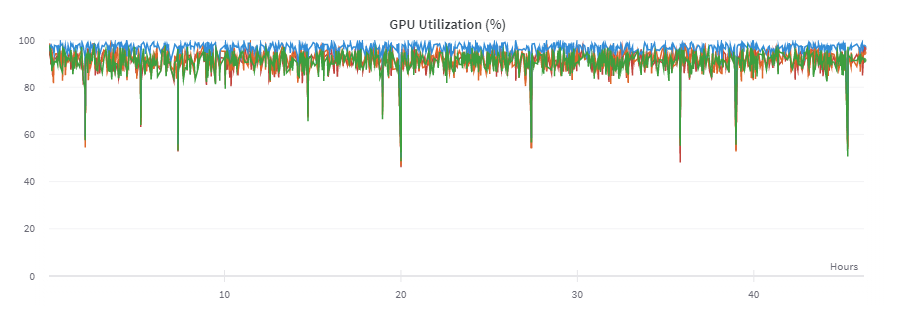

# StyleGAN
An unofficial implementation of StyleGAN for educational purposes, the task was to generate anime faces.

Now a universal loader is implemented for any standard models and loss functions. The StyleGAN config E (without mixing regulation), StyleGAN2 (it is not fully written yet) and R1GAN architectures are also implemented.

## Prerequisites

It is recommended packages to run `PyTorch` version 1.9.0+cu102 or higher, `Pillow`, optional `wandb`.

## Structure in the repository:

```bash
|   start.py               # Loader of models and dataset
|   losses.py              # Loss functions
|   starter.ipynb          # A notebook for experiments
|   trainer.py             # Universal Trainer class for train loop
|           
+---configs                # Configurations for running different models
|       R1GAN.json
|       StyleGAN.json
|       StyleGAN2.json
|       
+---models                 # Implementation of model architectures
|       R1GAN.py
|       StyleGAN.py
|       StyleGAN2.py
|       
\---utils                  # Support functions for working with images and models
    |   images.py
    |   register.py
    |   video.py
    |   weights.py
    |   

```

## Starting training

Example of starting model training:

```bash
python3 start.py "configs/StyleGAN.json" True
```

All training begins with running a script `start.py`, which is fed a json file, for example, `"config/StyleGAN.json"` and the next parameter is to enable or disable `wandb`, which is disabled by default.

Since a universal loader for GAN training was implemented, it was decided to transfer all the settings using a json file and `start.py` it takes the creation of a trainer and loading all the parameters from this config into it. For more detailed information on adding your models and your loss functions to the loader, see the wiki page [universal Loader](https://github.com/maximkm/StyleGAN/wiki/Universal-Loader).

Another way, for example, for training in jupiter notebook:

```python
from start import init_train

Trainer = init_train("configs/StyleGAN.json", wandb_set=True)
Trainer.train_loop()
```

For more detailed information on configuring configs, see the wiki page [configuring the config](https://github.com/maximkm/StyleGAN/wiki/Configuring-the-config).

## Examples of generation

Many launches were conducted for the selection of hyperparameters and testing, the result of training one of the StyleGAN launches with a resolution of 64x64 after 1 day of training on 1 x Tesla V100, on a dataset of 20k images with a resolution of 64x64, is shown below.


Also, the result of training the StyleGAN model for a resolution of 256x256, which was trained for 1.5 days on a 4 x Tesla V100, on a dataset of 92k images with a resolution of 256x256, is shown below:


The images are obtained by denormalization, so their saturation can be adjusted

## Generating images after training

By default `start.py` he loads the most recent trained weights from the folder specified in the config, and you can get access to the generator as `Trainer.G`. In addition, various presets were implemented for quick actions with the generator, an example is given below:

```python
from start import init_train
from utils.weights import LoadWeights
from utils.images import SaveImages

# Loading models and the latest weights without loading the dataset
Trainer = init_train("configs/StyleGAN.json", load_dataset=False)

# Loading custom weights with an inaccurate match
LoadWeights(Trainer, 'Weight/weight 42.pth')

# Save 10 randomly generated images to the img folder
SaveImages(Trainer, dir='img', cnt=10) 
```

Example of creating a video using the example of interpolation between two images:

```python
from utils.video import generate_video

samples = from_to_video(z_1, z_2)  # A tensor consisting of image frames
generate_video(samples)
```


## Detailed information on the implementation

To support multi GPU, `DataParallel` was used, instead of `DistributedDataParallel`, when testing StyleGAN on 4 x Tesla V100 GPU, a fairly high utilization was achieved:



To increase utilization, a written loader was also used, which loads the entire dataset into RAM, but because of this increases the initialization time.

## Credits

### Architectures
* StyleGAN architecture was provided by [A Style-Based Generator Architecture for Generative Adversarial Networks](https://arxiv.org/pdf/1812.04948.pdf).

* StyleGAN2 architecture was provided by [Analyzing and Improving the Image Quality of StyleGAN](https://arxiv.org/pdf/1912.04958.pdf) and [lucidrains/stylegan2-pytorch](https://github.com/lucidrains/stylegan2-pytorch).

* R1GAN architecture was provided by [Jinhyeok Yang](https://github.com/Yangyangii/GAN-Tutorial/blob/master/CelebA/R1GAN.ipynb).

### Loss Functions
* WGAN-GP was taken from this implementation [WGAN-GP](https://github.com/eriklindernoren/PyTorch-GAN/blob/a163b82beff3d01688d8315a3fd39080400e7c01/implementations/wgan_gp/wgan_gp.py)

### Anime datasets

* 21.6k images, 64x64, 217 MB: [Anime Faces](https://www.kaggle.com/soumikrakshit/anime-faces)

* 63.6k images, $\leqslant$ 64x64, 396 MB: [Anime Face Dataset](https://www.kaggle.com/splcher/animefacedataset)

* 92.2k images, 256x256, 1 GB: [another anime face dataset](https://www.kaggle.com/scribbless/another-anime-face-dataset)

* 140k images, 512x512, 11 GB: [animefaces-danbooru](https://www.kaggle.com/lukexng/animefaces-512x512)

* 500k images, $\geqslant$ 512x512, 99 GB: [Aligned Anime Faces](https://www.kaggle.com/reitanaka/alignedanimefaces)